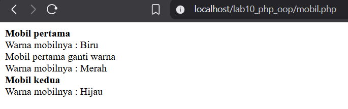
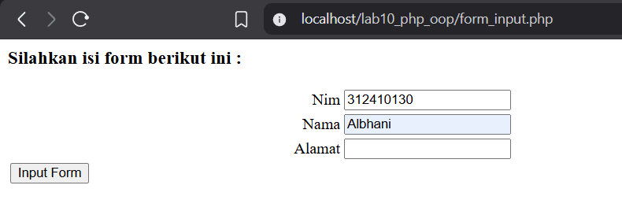

# Praktikum 10: PHP OOP

## Nama: Albhani Fadillah Haryady
## NIM: 312410130
## Kelas: TI 24 A1

### Langkah-langkah Praktikum

#### Buat file baru dengan nama mobil.php
```php
<?php
/**
 * Program sederhana pendefinisian class dan pemanggilan class.
 */
class Mobil
{
    private $warna;
    private $merk;
    private $harga;

    public function __construct()
    {
        $this->warna = "Biru";
        $this->merk  = "BMW";
        $this->harga = "10000000";
    }

    public function gantiWarna($warnaBaru)
    {
        $this->warna = $warnaBaru;
    }

    public function tampilWarna()
    {
        echo "Warna mobilnya : " . $this->warna;
    }
}

// membuat objek mobil
$a = new Mobil();
$b = new Mobil();

// memanggil objek pertama
echo "<b>Mobil pertama</b><br>";
$a->tampilWarna();

echo "<br>Mobil pertama ganti warna<br>";
$a->gantiWarna("Merah");
$a->tampilWarna();

// memanggil objek kedua
echo "<br><b>Mobil kedua</b><br>";
$b->gantiWarna("Hijau");
$b->tampilWarna();
?>
```


### Class Library

##### Contoh class library untuk membuat form.
```php
<?php
/**
 * Nama Class: Form
 * Deskripsi: Class untuk membuat form inputan text sederhana
 */
class Form
{
    private $fields = array();
    private $action;
    private $submit = "Submit Form";
    private $jumField = 0;

    public function __construct($action, $submit)
    {
        $this->action = $action;
        $this->submit = $submit;
    }

    public function displayForm()
    {
        echo "<form action='" . $this->action . "' method='POST'>";
        echo '<table width="100%" border="0">';

        for ($j = 0; $j < count($this->fields); $j++) {
            echo "<tr><td align='right'>" . $this->fields[$j]['label'] . "</td>";
            echo "<td><input type='text' name='" . $this->fields[$j]['name'] . "'></td></tr>";
        }

        echo "<tr><td colspan='2'>";
        echo "<input type='submit' value='" . $this->submit . "'>";
        echo "</td></tr>";

        echo "</table>";
        echo "</form>";
    }

    public function addField($name, $label)
    {
        $this->fields[$this->jumField]['name']  = $name;
        $this->fields[$this->jumField]['label'] = $label;
        $this->jumField++;
    }
}
?>
```

##### Contoh implementasi pemanggilan class library form.php
```php
<?php
/**
* Program memanfaatkan Program 10.2 untuk membuat form inputan sederhana.
**/
include "form.php";

echo "<html><head><title>Mahasiswa</title></head><body>";
$form = new Form("","Input Form");
$form->addField("txtnim", "Nim");
$form->addField("txtnama", "Nama");
$form->addField("txtalamat", "Alamat");
echo "<h3>Silahkan isi form berikut ini :</h3>";
$form->displayForm();
echo "</body></html>";

?>
```


##### Contoh lainnya untuk database connection dan query.
```php
<?php
class Database {
    protected $host;
    protected $user;
    protected $password;
    protected $db_name;
    protected $conn;

    public function __construct() {
        $this->getConfig();
        $this->conn = new mysqli($this->host, $this->user, $this->password, $this->db_name);

        if ($this->conn->connect_error) {
            die("Connection failed: " . $this->conn->connect_error);
        }
    }

    private function getConfig() {
        include_once("config.php");
        $this->host     = $config['host'];
        $this->user     = $config['username'];
        $this->password = $config['password'];
        $this->db_name  = $config['db_name'];
    }

    public function query($sql) {
        return $this->conn->query($sql);
    }

    public function get($table, $where = null) {
        if ($where) {
            $where = " WHERE " . $where;
        }

        $sql = "SELECT * FROM " . $table . $where;
        $sql = $this->conn->query($sql);
        $sql = $sql->fetch_assoc();
        return $sql;
    }

    public function insert($table, $data) {
        if (is_array($data)) {
            foreach($data as $key => $val) {
                $column[] = $key;
                $value[]  = "'{$val}'";
            }

            $columns = implode(",", $column);
            $values  = implode(",", $value);
        }

        $sql = "INSERT INTO " . $table . " (" . $columns . ") VALUES (" . $values . ")";
        $sql = $this->conn->query($sql);

        return ($sql === true);
    }

    public function update($table, $data, $where) {
        $update_value = [];

        if (is_array($data)) {
            foreach($data as $key => $val) {
                $update_value[] = "$key='{$val}'"; // semicolon sudah diperbaiki
            }
            $update_value = implode(",", $update_value);
        }

        $sql = "UPDATE " . $table . " SET " . $update_value . " WHERE " . $where;
        $sql = $this->conn->query($sql);

        return ($sql === true);
    }

    public function delete($table, $filter) {
        $sql = "DELETE FROM " . $table . " " . $filter;
        $sql = $this->conn->query($sql);

        return ($sql === true);
    }
}
?>
```


### Pertanyaan dan Tugas

Implementasikan konsep modularisasi pada kode program pada praktukum sebelumnya
dengan menggunakan class library untuk form dan database connection.

#### Jawab:

Struktur Folder
```markdown
projek/
│── index.php
│── config/
│ └── config.php
│── classes/
│ ├── database.php
│ └── form.php
│── modules/
│ └── user/
│ ├── list.php
│ ├── add.php
│ ├── edit.php
│ ├── delete.php
│ ├── proses_add.php
│ └── proses_edit.php
└── assets/
```

#### Class Library

#####  Class Database (classes/database.php)

##### Class ini berfungsi untuk:

- Membuka koneksi database
- Menjalankan query
- Mengambil seluruh data tabel
- Mengambil data berdasarkan ID
- Insert, Update, Delete

```php
<?php
class Database {
    protected $host;
    protected $user;
    protected $password;
    protected $db_name;
    protected $conn;

    public function __construct() {
        $this->getConfig();
        $this->conn = new mysqli($this->host, $this->user, $this->password, $this->db_name);

        if ($this->conn->connect_error) {
            die("Koneksi gagal: " . $this->conn->connect_error);
        }
    }

    private function getConfig() {
        include(__DIR__ . "/../config/config.php");

        $this->host     = $config['host'];
        $this->user     = $config['username'];
        $this->password = $config['password'];
        $this->db_name  = $config['db_name'];
    }

    public function query($sql) {
        return $this->conn->query($sql);
    }

    public function getAll($table) {
        return $this->conn->query("SELECT * FROM $table");
    }

    public function getById($table, $where) {
        $query = $this->conn->query("SELECT * FROM $table WHERE $where");
        return $query->fetch_assoc();
    }

    public function insert($table, $data) {
        $columns = implode(",", array_keys($data));
        $values  = "'" . implode("','", array_values($data)) . "'";

        return $this->conn->query("INSERT INTO $table ($columns) VALUES ($values)");
    }

    public function update($table, $data, $where) {
        $update = [];
        foreach ($data as $key => $val) {
            $update[] = "$key='$val'";
        }

        $updateValue = implode(",", $update);
        return $this->conn->query("UPDATE $table SET $updateValue WHERE $where");
    }

    public function delete($table, $where) {
        return $this->conn->query("DELETE FROM $table WHERE $where");
    }
}
?>
```

##### Class Form (classes/form.php)

Class ini mempermudah pembuatan form secara dinamis.

```php
<?php
class Form {
    private $fields = [];
    private $action;
    private $submit;

    public function __construct($action, $submit = "Submit") {
        $this->action = $action;
        $this->submit = $submit;
    }

    public function addField($name, $label) {
        $this->fields[] = ["name" => $name, "label" => $label];
    }

    public function display() {
        echo "<form action='{$this->action}' method='POST'>";
        echo "<table>";

        foreach ($this->fields as $field) {
            echo "<tr>
                    <td align='right'>{$field['label']}</td>
                    <td><input type='text' name='{$field['name']}' required></td>
                  </tr>";
        }

        echo "<tr><td colspan='2'>
            <input type='submit' value='{$this->submit}'>
        </td></tr>";

        echo "</table>";
        echo "</form>";
    }
}
?>
```